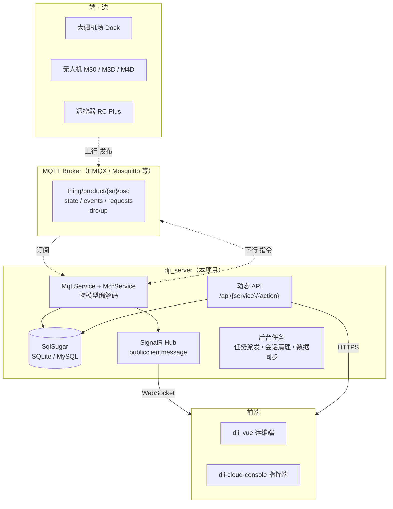

<div align="center">

# dji_server

**大疆机场（DJI Dock）上云后端 · 让大疆上云更简单**

基于大疆官方「上云 API」物模型，把 MQTT 上行数据落库、把下行指令封装成 HTTP 动态 API，
并通过 SignalR 实时推送给前端。

<p>


</p>

</div>

---

## 这是什么

大疆官方给出了上云 API，但没有给出可用的服务端：**云司空 2 闭源**，而开源的
`Cloud-API-Demo` 已于 2025-04-10 停止维护，且仅作协议演示、不适合生产。

`dji_server` 是一套**面向生产的上云服务端**：

- 对接大疆机场（Dock / Dock 2 / Dock 3）与 M30 / M3D / M3TD / M4D 等机型的 MQTT 物模型
- 把设备上报的状态、OSD、HMS 告警、媒体文件、航线任务结果全部落库
- 把云端 → 设备的控制指令（开舱、起飞、直播、航线下发、DRC）封装成 HTTP API
- 通过 SignalR 把高频遥测推给前端，**前端不需要直连 MQTT**（凭证不出服务端）

配合使用的两个前端：

| 仓库 | 定位 |
|---|---|
| [dji_vue](https://github.com/guipie/dji_vue) | 后台运维管理端（飞行区绘制、航线管理、设备台账、机库监控） |
| [dji-cloud-console](https://github.com/guipie/dji-cloud-console) | 桌面 / 实时指挥端（Tauri + Vue3，实时态势与 DRC 指令飞行） |

---

## 功能一览

| 模块 | 能力 |
|---|---|
| **设备物模型** | 机场 / 无人机 / 遥控器 / 负载的上下线拓扑（thing/product/{sn}/state）与 OSD 订阅 |
| **航线任务** | 航线文件上传（WPML/KMZ）、任务下发、进度回传、任务调度（含自动派发 Job） |
| **直播** | 对接自建 SRS，直播启停、路数配额、会话超时回收 |
| **媒体文件** | 机场 / 无人机拍摄的媒体清单与下载，支持 OSS 对象存储 |
| **HMS 健康告警** | 设备健康管理系统告警的接收、落库、分级与推送 |
| **空域感知** | AirSense 告警（附近有载人飞机）接收与转发 |
| **飞行区 / 禁飞区** | 作业区（dfence）与禁飞区（nfz）的增删改查，并导出大疆格式 `FeatureCollection` |
| **远程日志 / OTA** | 设备日志上报、固件升级任务下发 |
| **多租户工作空间** | 按 workspace 隔离设备与数据，用户可归属多个空间 |
| **系统管理** | 用户 / 角色 / 菜单 / 字典 / 任务调度 / 操作审计（Admin.NET 体系） |

---

## 部署必备组件

按需部署：最小化（仅设备拓扑 + 航线任务）只要 **MQTT Broker + 数据库**；启用直播 / 多副本 / OSS 时再补齐其余组件。

| 组件 | 等级 | 用途 | 推荐选型 |
|---|---|---|---|
| **MQTT 消息服务器** | 必备 | 设备上下行通道：物模型、OSD、指令、DRC | EMQX / Mosquitto（任意 MQTT 3.1.1/5） |
| **数据库** | 必备 | 状态、OSD、HMS、媒体清单、航线、飞行区全量落库 | MySQL / SQL Server / PostgreSQL / Oracle / SQLite；国产库：达梦 DM、人大金仓 KingbaseES、南大通用 GBase、华为 GaussDB 等（SqlSugar 全适配，CodeFirst 建表） |
| **NTP 时间服务器** | 强烈建议 | 机场与云端时钟同步，偏差 >30s 立即任务会被拒（报错无时钟线索） | 内网自建 NTP；**外网可直接用云厂商公共 NTP**：阿里云 `ntp.aliyun.com`、腾讯云 `time1.cloud.tencent.com`、国家授时中心 `ntp.ntsc.ac.cn` |
| **Redis** | 推荐（多副本必备） | 缓存、JWT 黑名单、限流；SignalR 横向扩展 backplane | Redis 6+ / 哨兵集群；单副本可切 `Cache.json → Memory` 不用 Redis |
| **SRS 直播服务器** | 按需（直播） | RTMP 推流 / FLV·HLS 拉流 | SRS 4.x / 5.x；`Dji.json → Live.Enabled = false` 可完全不部署 |
| **对象存储** | 按需（媒体 / KMZ） | 媒体文件、KMZ 航线、固件包持久化 | Minio（自建） / 阿里云 OSS / 七牛云 / 腾讯云 COS / 华为云 OBS；**未配置 OSS 时自动回退服务端本地存储**，零依赖起步 |

> 云存储「未配置即本地」规则：`Upload.json → OSSProvider` 留空时走 `Dji.Web.Entry/wwwroot` 下的本地上传目录，无需额外部署；联调 / 生产再切到 Minio 或任意云 OSS。

---

## 技术选型

| 层次 | 选型 | 说明 |
|---|---|---|
| 运行时 | **.NET 10** | 全仓目标框架 `net10.0` |
| Web 框架 | 整体更名为 `Dji.*` 命名空间，可随仓库二次修改 |
| ORM | **SqlSugar** | CodeFirst，SQLite 开箱即用，可切 MySQL / PostgreSQL 等 |
| MQTT | **MQTTnet** | 作为 Broker 客户端，订阅大疆物模型主题 |
| 实时推送 | **SignalR** | `/hubs/onlineUser`，token 走 query string |
| 对象映射 | **Mapster** | 比 AutoMapper 更轻，编译期生成 |
| 认证 | **JWT + SM2 国密** | 登录密码由前端**先用 SM2 公钥加密**再传输 |
| 缓存 | **内存 / Redis** | 可切换，Redis 模式下支持 SignalR 横向扩展（backplane） |

---

## 架构



### 数据流要点

1. **上行**：设备 → MQTT Broker → 本服务 `Mq*Service` 解码 → 落库 + 推 SignalR → 前端
2. **下行**：前端 HTTP 调 `/api/djiDock/execute` 等 → 服务端编码 → 发布到 `thing/product/{sn}/services` → 设备
3. **前端永远不直连 MQTT**：Broker 凭证、AppKey / AppLicense 都只在服务端

---

## 目录结构

```
dji_server/
├── Dji.Server.sln
├── Dji.Web.Entry/          # 启动入口（Program.cs、wwwroot、db、Dockerfile）
├── Dji.Web.Core/           # Web 层（Startup、中间件、Swagger、鉴权）
├── Dji.Application/        # 业务层
│   ├── Cloud/              #   大疆物模型：Mq*Service（按 Topic 域拆分）
│   ├── Service/            #   业务 Service（自动暴露为动态 API）
│   ├── Configuration/      #   全部配置项（17 个 json）
│   ├── SeedData/           #   种子数据
│   └── Job/                #   后台定时任务
├── Dji.Core/               # 核心层（实体、仓储、授权、SignalR、工具类）
│   ├── Entity/DjiEntity/   #   21 张业务表
│   └── Util/GM/            #   SM2 国密加解密
└── Plugins/
    ├── Dji.Pure/                               # Furion 源码（内联，命名空间已改为 Dji.*）
    ├── Dji.Pure.Extras.DependencyModel.CodeAnalysis/
    ├── Dji.Extras.Authentication.JwtBearer/
    ├── Dji.Extras.ObjectMapper.Mapster/
    ├── Dji.Plugin.Elsa/                        # 工作流
    └── Dji.Plugin.GoView/                      # 大屏设计
```

---

## 快速开始

### 环境要求

| 组件 | 版本 | 备注 |
|---|---|---|
| .NET SDK | **10.0+** | `dotnet --list-sdks` 确认 |
| 数据库 | SQLite（默认）/ MySQL 5.7+ | SQLite 零配置，CodeFirst 自动建表 |
| MQTT Broker | 任意支持 MQTT 3.1.1/5 的 | EMQX / Mosquitto；**联调真机才需要** |
| SRS 媒体服务器 | 4.x / 5.x | **只有需要直播才要** |

### 1. 准备配置

`Dji.Application/Configuration/` 目录已被 `.gitignore` 排除（避免真实凭证入库），
所以 clone 下来是空的。请从模板复制：

```bash
cp docs/config-template/*.json Dji.Application/Configuration/
```

然后**至少**填写这几项（详见下方「配置详解」）：

- `Dji.json` → `AppId` / `AppKey` / `AppLicense`（大疆开发者凭证）
- `Dji.json` → `Mqtt.Server` / `Username` / `Password`
- `App.json` → `Cryptogram.PublicKey` / `PrivateKey`（**必须重新生成**，见安全须知）
- `JWT.json` → `IssuerSigningKey`（**必须替换**）

### 2. 启动

```bash
dotnet build Dji.Server.sln
dotnet run --project Dji.Web.Entry
```

首次启动会自动 CodeFirst 建表并写入种子数据。看到下面这行即启动成功：

```
Now listening on: http://0.0.0.0:5005
```

> **删库重来前先确认种子开关。** `Database.json` 主库的 `SeedSettings.EnableInitSeed` 为 `false` 时
> 只 CodeFirst 建表、不写种子数据，全新库会得到一个没有菜单、没有空间的空壳系统。
> 需要重建基础数据（账号、菜单、设备 / 载荷型号、默认工作空间及其用户归属）时，把它改成 `true` 跑一次，
> 数据落库后可以改回 `false`。
> 种子是「按主键 insert-or-update」：保持 `true` 的好处是缺失的行每次启动都会被自动补回来，
> 代价是手工改过的菜单标题 / 排序也会被拉回种子里的值。

### 3. 验证

| 端点 | 预期 |
|---|---|
| <http://localhost:5005/kapi> | Swagger UI（注意是 `kapi`，**不是** `swagger`） |
| `GET /api/sysAuth/captcha` | 返回信封 `{ "code": 200, ..., "result": { "id": ..., "img": ... } }` |

### 4. 登录

种子数据内置了系统账号（**密码统一为 `123456`，生产环境务必首次登录后立即修改**）：

| 账号 | 角色 |
|---|---|
| `superadmin` | 超级管理员 |
| `admin` | 系统管理员 |

> 登录时密码必须先用 SM2 公钥加密后再 POST，不能传明文。两个前端都已内置该逻辑。

### 5. 默认工作空间

初始化会建一个名为「默认空间」的工作空间（`WorkspaceId = default`），种子账号全部归属它，且被设为各自的默认空间。

后续**新建**的账号不必手工去「空间成员」里挂：首次拉取自己的空间列表时（`/api/djiWorkspaceUser/My`）
若发现该用户没有任何空间归属，会自动补进默认空间。原因是设备 / 航线 / 飞行区表上的 `WorkspaceId` 是 NOT NULL，
业务侧保存时用「当前用户的默认空间」兜底，用户不属于任何空间时这些接口只会抛错。

### Docker

`Dji.Web.Entry/Dockerfile` 只有运行阶段，**需要先在宿主机 publish**：

```bash
dotnet publish Dji.Web.Entry/Dji.Web.Entry.csproj -c Release -o ./publish
docker build -f Dji.Web.Entry/Dockerfile -t dji-server ./publish
docker run -p 5005:5005 dji-server
```

---

## 配置详解

配置位于 `Dji.Application/Configuration/`，均为 **带注释 JSON**。

### `Dji.json` — 大疆上云与媒体

```jsonc
{
  "Dji": {
    // 以下三项通过 MQTT 的 config 应答下发给机场
    "AppId": "",        // 大疆开发者 App ID
    "AppKey": "",       // 大疆开发者 App Key
    "AppLicense": "",   // 大疆开发者 App License
    // ⚠️ 地址必须是【机场侧可达】的地址，不能写 localhost
    "FileBaseUrl": "",  // KMZ 对外访问前缀
    "NtpServerHost": "", // 强烈建议配：机场与云端时钟偏差过大会让立即任务被拒（30s 容差）
    "Live": {
      "Enabled": true,
      "RtmpPushBaseUrl": "rtmp://<SRS_HOST>:1935/live",  // 机场推流（不能被复写浏览器）
      "FlvPlayBaseUrl":  "http://<SRS_HOST>:8080/live",  // 浏览器拉流，低延迟首选
      "HlsPlayBaseUrl":  "http://<SRS_HOST>:8080/live",  // 兼容性兜底
      "MaxSessionMinutes": 120
    }
  },
  "Mqtt": {
    "Server": "<BROKER_HOST>",
    "Port": 1883,
    "SubscribedTopics": [
      "sys/product/+/status",
      "thing/product/+/osd",
      "thing/product/+/state",
      "thing/product/+/events",
      "thing/product/+/drc/up",
      "..."
    ]
  }
}
```

> **NTP 是第一个要填的坑**：机场与云端时钟偏差超过 30 秒，立即任务会被直接拒绝，
> 且报错信息看不出是时钟问题。

### `App.json` — 动态 API 与国密

```jsonc
{
  "Urls": "http://0.0.0.0:5005",
  "DynamicApiControllerSettings": {
    "AsLowerCamelCase": true,   // 决定 /api/sysAuth/userInfo 这种小驼峰路由
    "KeepVerb": false
  },
  "Cryptogram": {
    "CryptoType": "SM2",        // 登录密码加密算法
    "PublicKey":  "<130位hex>", // 与前端共用：前端加密、服务端解密
    "PrivateKey": "<64位hex>"   // ⛔ 绝对不能进版本库
  }
}
```

### 其余配置

| 文件 | 用途 |
|---|---|
| `Database.json` | 主库 + 日志库连接串，支持 SQLite / MySQL / PostgreSQL / Oracle 等 |
| `JWT.json` | JWT 签发参数（密钥、签发方、有效期容错） |
| `Cache.json` | 缓存类型（Memory / Redis）、Redis 连接串、SignalR backplane |
| `Swagger.json` | 文档分组与访问策略 |
| `Upload.json` | 本地上传限制与 OSS（Minio / 阿里云 / 七牛 / 腾讯云 / 华为云） |
| `Email.json` / `Sms.json` / `Wechat.json` / `OAuth.json` | 消息与第三方登录 |
| `Captcha.json` / `Limit.json` / `Logging.json` / `CodeGen.json` / `Enum.json` | 验证码、限流、日志、代码生成、枚举 |

---

## MQTT 物模型

订阅主题遵循大疆标准，单设备序列号用 `+` 通配：

| 主题 | 方向 | 说明 |
|---|---|---|
| `sys/product/{sn}/status` | 上行 | 设备拓扑 / 子设备挂载关系变化 |
| `thing/product/{sn}/osd` | 上行 | 高频 OSD（机场 + 无人机） |
| `thing/product/{sn}/state` | 上行 | 设备上下线拓扑、固件版本、能力集 |
| `thing/product/{sn}/events` | 上行 | HMS 告警、AirSense、飞行任务事件 |
| `thing/product/{sn}/requests` | 上行 | 设备主动请求（如请求云端下发设备能力配置） |
| `thing/product/{sn}/services_reply` | 上行 | 指令应答（含 `tid` / `bid` 用于关联） |
| `thing/product/{sn}/drc/up` | 上行 | DRC 模式下的链路状态 |
| `thing/product/{sn}/services` | 下行 | 云端下发指令 |
| `thing/product/{sn}/drc/down` | 下行 | DRC 杆量与控制指令 |

对应的处理服务在 `Dji.Application/Cloud/`：
`MqDeviceService` / `MqDockControlService` / `MqLiveService` / `MqWaylineService` /
`MqMediaService` / `MqHmsService` / `MqAirSenseService` / `MqOtaService` / `MqLogService` / `MqOrgService`。

---

## HTTP 动态 API 约定

动态 API 生成，规则：

```
/api/{服务类名去掉 Service 后缀后小驼峰}/{动作名}
```

- 例：`SysAuthService.UserInfo` → `GET /api/sysAuth/userInfo`
- 例：`DjiFlyZoneService.ExportDji` → `POST /api/djiFlyZone/exportDji`
- **默认全部是 POST**（因为 `KeepVerb: false`），需要 GET 的接口要在 `[HttpGet]` 上显式标注，或修改该配置

### 统一响应信封

不是常见的 `{code, data}`，而是：

```json
{
  "code": 200,
  "type": "success",
  "message": "",
  "result": { "...业务数据..." },
  "extras": null,
  "time": "2026-09-29T12:00:00"
}
```

- **数据在 `result` 字段**，不是 `data`
- **成功判据是 `code === 200`**（code 直接就是 HTTP 状态码）
- 依据：`Dji.Core/Util/AdminResultProvider.cs`

### 鉴权相关

| 方法 | 路径 | 说明 |
|---|---|---|
| GET | `/api/sysAuth/loginConfig` | 是否开启图形验证码，登录页先调它 |
| GET | `/api/sysAuth/captcha` | `{ id, img(base64) }` |
| POST | `/api/sysAuth/login` | `{ account, password(SM2密文), codeId, code }` |
| GET | `/api/sysAuth/userInfo` | 用户档案 + `buttons` 权限码 |
| GET | `/api/sysAuth/refreshToken?accessToken=` | 换新 token |
| POST | `/api/sysAuth/logout` | 登出 |

容易踩的三个点：

1. **账号字段叫 `account`**，不是 `username`
2. **token 同时从响应头下发**：`access-token` / `x-access-token`（已在 CORS 的 `WithExposedHeaders` 暴露）
3. **accessToken 默认 20 分钟过期**，前端需要做「401 → 续期 → 重放一次」

---

## 实时通道：SignalR

dji_server **没有裸 WebSocket 端点**，实时数据全部走 SignalR：

```
ws://host:5005/hubs/onlineUser?access_token=<jwt>
```

| 项 | 值 |
|---|---|
| 事件名 | **`publicclientmessage`**（一个事件承载全部业务） |
| 载荷 | `CloudMqData<T>`：`{ tid, bid, method, timeStamp, gateway, droneSn, topic, data, ext }` |
| 分发方式 | **必须按 `method` 二次分发**，而不是按事件名 |

常见的 `method`：

| method | 内容 |
|---|---|
| `dockOsd` / `droneOsd` | 机场 / 无人机 OSD（注意不是 `osd`） |
| `hms` | 健康告警 |
| `flighttask_progress` | 航线任务进度 |
| `update_topo` | 设备拓扑变化 |
| `airsense_warning` | 空域感知告警 |

> ⚠️ **Hub 里没有业务指令方法**，只有鉴权和消息推送。
> 所以控制类指令（开舱、直播、DRC 杆量）**必须走 HTTP**，不要试图在 WebSocket 上发。
>
> ⚠️ 服务端按 **workspace 全量推送**：100 台 × 0.5Hz ≈ 50 msg/s，客户端必须自己聚合节流，否则必卡。

---

## ⚠️ 安全须知（部署前必读）

本仓库**在开源前已做凭证脱敏**，但你 clone 到本地 / 部署上线时**必须**替换下面这些占位符。
下面每一项如果用默认值上线，都属于安全事故。

| 文件 | 字段 | 占位符 | 泄露后果 |
|---|---|---|---|
| `App.json` | `Cryptogram.PrivateKey` | `<SM2_PRIVATE_KEY_HEX>` | **可解密所有用户登录密码** |
| `JWT.json` | `IssuerSigningKey` | `<JWT_SIGNING_KEY>` | 可伪造任意用户 token，直接接管系统 |
| `Cache.json` | Redis 连接串 / 哨兵密码 | `<REDIS_PASSWORD>` 等 | Redis 失守，可盗用全部会话 |
| `Upload.json` | `OSSProvider.AccessKey/SecretKey` | `<OSS_ACCESS_KEY>` 等 | 对象存储被刷量 / 数据泄露 |
| `Dji.json` | MQTT 账号密码、AppKey/AppLicense | `<MQTT_PASSWORD>` 等 | Broker 与大疆开发者凭证失守 |
| `Database.json` | MySQL 连接串 | `<DB_PASSWORD>` | 数据库失守 |

另外：

- 种子账号 `superadmin` / `admin` 的初始密码是 **`123456`**，上线第一件事就是改掉。
- 生产环境建议关闭 Swagger：`App.json → AppSettings.InjectSpecificationDocument = false`。

### 重新生成 SM2 密钥对（实测可用）

```bash
openssl ecparam -name SM2 -genkey -noout -out sm2.key
openssl ec -in sm2.key -text -noout | \
  awk '/^priv:/{f=1;next}/^pub:/{f=0;g=1;next}/^ASN1/{f=0;g=0}{gsub(/[ :]/,"");if(f)p=p$0;if(g)q=q$0}END{print "PublicKey  ("length(q)") = "q"\nPrivateKey ("length(p)") = "p}'
rm -f sm2.key
```

输出应形如 `PublicKey (130) = 04...` / `PrivateKey (64) = ...`。

- **公钥**：同时填到 `App.json → Cryptogram.PublicKey` 和两个前端的 `VITE_SM2_PUBLIC_KEY`
- **私钥**：只填服务端 `Cryptogram.PrivateKey`，⛔ 绝不能给前端、绝不能进版本库

> 两者必须**成对**。错配的症状是：登录恒失败，且服务端只报「账号或密码错误」，
> 没有任何线索指向密钥不匹配 —— 这是本项目最容易浪费半天时间的一个坑。

---

## 已知问题

| 现象 | 原因 | 处理 |
|---|---|---|
| Swagger 的「所有接口」分组返回 **500** | `DjiDock.Dto.DockOptionOutput` 与 `DjiWayline.Dto.DockOptionOutput` **同名类**，Swashbuckle 生成 schemaId 冲突 | 二选一：Swagger 配置加 `options.CustomSchemaIds(t => t.FullName)`，或重命名其中一个 DTO |
| 后端运行时 `dotnet build` 报 `CS2012 无法打开 .pdb` | 运行中的进程占用了 pdb | 停掉后端再编译，或用 `dotnet build -p:DebugType=none` |
| 机场拒绝立即任务 | 机场与云端时钟偏差 > 30s | 配 `Dji.json → NtpServerHost` |
| 高德地图报 `INVALID_USER_SCODE` | JS API 2.0 开了安全密钥但前端没传 | 前端从设置页或环境变量补 `VITE_AMAP_SECURITY_CODE` |

---

## 致谢与来源

本项目在下述开源成果之上构建，在此表示感谢：

- **Admin.NET** —— 动态 API、鉴权、缓存、任务调度体系（原始 MIT 协议，已源码内联到 `Plugins/`）
- **MQTTnet** / **SqlSugar** / **Mapster** 等 .NET 生态组件
- 大疆开放平台的上云 API 文档与物模型定义

> 派生自 MIT 协议代码的部分遵循原协议；本项目整体按 GPL-3.0 发布。

---

## 开源协议

本项目使用 [GPL-3.0](./LICENSE) 协议。

> 本项目涉及无人机飞行作业。**请务必遵守中国民用航空局及当地关于无人机运行的法律法规**，
> 取得必要资质与空域许可，接入你自己的鉴权、审计与飞行安全合规流程。
> 本项目仅为学习与研究大疆上云协议的参考实现，作者不对任何飞行安全事件负责。
